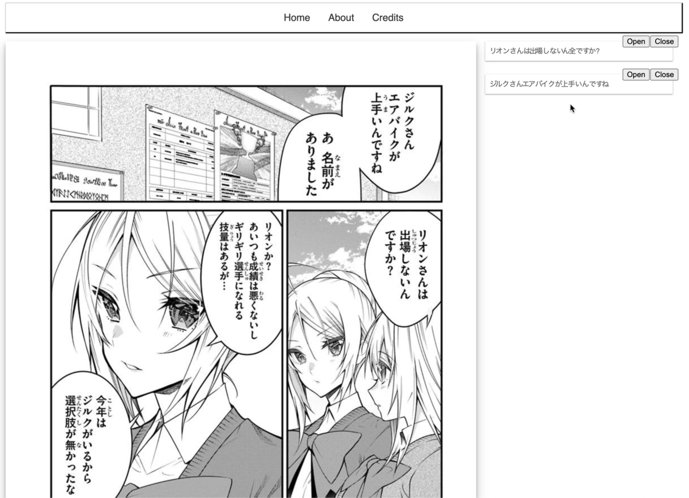

# Manga App

OCR Tool for reading Japanese manga.

- Frontend: JavaScript (React App) by https://github.com/unknown-cat
- Backend: Python (aiohttp API server within docker) by https://github.com/Faith-des

# Status of Project

100% WIP

# Usage



# Run server

from server folder
`docker-compose up`
* tesserct with all language (quite big volume to download first time)

# Run server from zero

from client folder
```
yarn install
yarn build
yarn start
```

# Image location
TODO: to make one shared (client+server) place for images.
Currently just working with one build-in image

# Japanese Dictionary file (jap_dict/jamdict.db)

To have a Japanese dictionary download the file jamdict.db from:
https://drive.google.com/drive/u/1/folders/1z4zF9ImZlNeTZZplflvvnpZfJp3WVLPk
